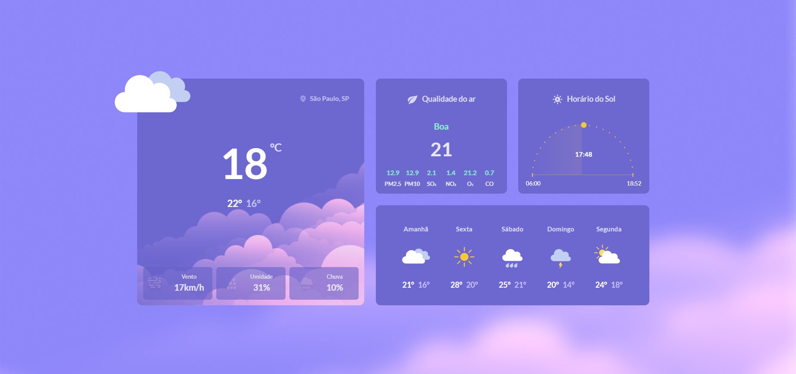
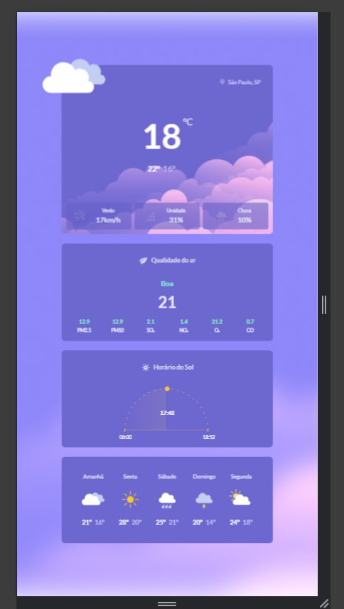

# Tela de Clima

Este projeto é uma aplicação estática de visualização do clima, desenvolvida com **HTML**, **CSS** e **JavaScript**. O objetivo é treinar minhas habilidades de front-end e praticar a responsividade em layouts.

## 🛠️ Tecnologias Utilizadas

- **HTML5**: Estruturação semântica do conteúdo.
- **CSS3**: Estilização e layout responsivo.
- **JavaScript**: Funcionalidades interativas, como manipulação do DOM.

## 📸 Screenshots

    
    

## 🚀 Funcionalidades

- **Visualização do Clima**: Exibe informações fictícias sobre as condições climáticas, como temperatura, umidade e condições do tempo.
- **Design Responsivo**: A interface se adapta a diferentes tamanhos de tela, garantindo uma boa experiência em dispositivos móveis e desktops.
- **Interatividade**: Utiliza JavaScript para adicionar interatividade, como a troca de dados climáticos ao clicar em botões.

## 📝 Aprendizados

- **Manipulação do DOM**: Aprendi a manipular elementos da página utilizando JavaScript.
- **Design Responsivo**: Trabalhei em como criar layouts responsivos que funcionam bem em diferentes dispositivos, melhorando a experiência do usuário.
- **Estilização com CSS**: Pratiquei a estilização de componentes usando CSS para criar uma interface atraente.
